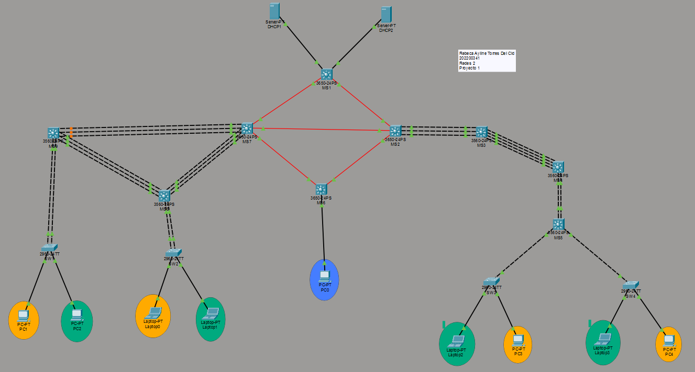

# Manual Técnico - Proyecto 1: Chapin Red 

**Autor:** Rebeca Ayline Torres Del Cid  
**Carné:** 202200341  
**Curso:** Laboratorio de Redes de Computadoras 2  
**Protocolo Asignado:** EIGRP (Carné Impar)

---

## 1. Topología Funcional de la Red

El proyecto "Chapin Red" consiste en una infraestructura de red empresarial distribuida en 4 edificios principales interconectados mediante una red MAN:
- Edificio Izquierdo (Arquitectura de 3 capas: Core, Distribución, Acceso)
- Edificio Derecho
- Nodos de Enrutamiento y Administración (Servidores y PC Central)

La arquitectura está diseñada con alta disponibilidad, segmentación lógica mediante VLANs y seguridad de Capa 3.



---

## 2. Esquema de Direccionamiento IP (Subnetting)

El diseño de la red se segmentó utilizando:
- **VLSM (Variable Length Subnet Mask)** para las redes LAN.
- **FLSM (Fixed Length Subnet Mask)** para los enlaces WAN/MAN.

### 2.1 Redes de Usuarios (VLSM) — Base: 192.188.41.0/24

Se requirió soporte para los departamentos operativos, dividiendo la red en subredes de tamaño variable para optimizar el direccionamiento basándose en el carné 202200341.

| Departamento / VLAN Name | VLAN ID | Dirección de Red | Gateway (SVI) | Máscara |
| :--- | :---: | :--- | :--- | :--- |
| VLAN_Naranja_EdificioIZQ_202200341 | 10 | 192.188.41.0/26 | 192.188.41.1 | 255.255.255.192 |
| VLAN_Verde_EdificioIZQ_202200341 | 20 | 192.188.41.64/26 | 192.188.41.65 | 255.255.255.192 |
| VLAN_Naranja_EdificioDER_202200341 | 30 | 192.188.41.128/27 | 192.188.41.129 | 255.255.255.224 |
| VLAN_Verde_EdificioDER_202200341 | 40 | 192.188.41.160/27 | 192.188.41.161 | 255.255.255.224 |
| VLAN_ADMIN_EdificioADMIN_202200341 | 99 | 192.188.41.192/28 | 192.188.41.193 | 255.255.255.240 |

### 2.2 Enlaces Punto a Punto MAN (FLSM) — Base: 10.4.41.0/24

Las interconexiones de fibra óptica entre los switches multicapa (Capa 3) utilizan subredes `/30` para optimizar el direccionamiento a solo 2 IPs útiles por enlace.

| Enlace Lógico | Dirección de Red | Máscara |
| :--- | :--- | :--- |
| Enlaces a Servidores DHCP | 10.4.41.0/30 y 10.4.41.4/30 | 255.255.255.252 |
| Enlaces MAN entre Edificios | 10.4.41.8/30 y subsiguientes | 255.255.255.252 |

---

## 3. Infraestructura de Capa 2 (Switching y Redundancia)

Para garantizar la disponibilidad en la capa de acceso y distribución, se implementaron protocolos de agregación de enlaces y prevención de bucles (STP).

**Protocolos Implementados:**
- **LACP (IEEE 802.3ad):** Configurado en 5 enlaces troncales del Edificio Izquierdo.
- **PAgP (Cisco Proprietary):** Configurado en 3 enlaces troncales del Edificio Derecho.
- **VTP (VLAN Trunking Protocol):** Dominio `CHAPINRED`, contraseña `202200341`, configurando el MS7 como Servidor y el resto de los equipos como Clientes.

**Comandos de Ejemplo — LACP (MS7, Edificio Izquierdo):**
```text
interface range GigabitEthernet1/0/4 - 6
 switchport trunk encapsulation dot1q
 switchport mode trunk
 channel-group 5 mode active
```
## 4. Enrutamiento Dinámico (Capa 3)

Al tener un carné con terminación impar, se configuró el protocolo EIGRP utilizando el Sistema Autónomo (AS) 10. Este protocolo permite el intercambio dinámico de las rutas LAN (192.188.41.0) y WAN (10.4.41.0) a través de los 4 edificios de la topología.

**Comandos de Configuración EIGRP —  MS1 / MS7 / MS2:**
```text
router eigrp 10
 no auto-summary
 network 10.4.41.0 0.0.0.255
 network 192.188.41.0 0.0.0.255
 ```

 ## 5. Servicios de Red y DHCP Centralizado

Los servicios DHCP se centralizaron conectando dos servidores al switch MAN MS1.

| **Servidor** | **Dirección IP** | **Departamentos Asignados** | **Ubicación Física** |
| ------------ | ---------------- | ---------------------------- | -------------------- |
| **DHCP 1**   | 10.4.41.2        | Naranja Izq, Verde Izq, ADMIN | Nudo Superior        |
| **DHCP 2**   | 10.4.41.6        | Naranja Der, Verde Der        | Nudo Superior        |

Para permitir que las computadoras de los edificios Izquierdo y Derecho obtengan direcciones IP dinámicas desde redes distintas a las de los servidores, se implementó DHCP Relay (`ip helper-address`) en las interfaces virtuales (SVIs) de los gateways correspondientes.

### Configuración DHCP Relay — Ejemplo en MS7

```plaintext
interface vlan 10
 ip helper-address 10.4.41.2
interface vlan 20
 ip helper-address 10.4.41.2
```

## 6. Políticas de Seguridad (Listas de Control de Acceso - ACL)
Se implementaron políticas estrictas de seguridad perimetral a nivel de Capa 3, aplicadas directamente en las interfaces virtuales (SVI).

| **Segmento** | **Política de Seguridad** |
| ------------ | -------------------------- |
| **VLAN Naranja / Verde** | Se permite el tráfico interno inter-edificio de su mismo color y el paso de solicitudes DHCP/ICMP. |
| **VLAN Naranja → Verde** | Se deniega por completo la comunicación inter-VLAN. |
| **VLAN Verde → Naranja** | Se deniega por completo la comunicación inter-VLAN. |
| **VLAN Operativas → ADMIN** | Se bloquea totalmente cualquier intento de iniciar conexiones hacia la VLAN ADMIN. |
| **VLAN ADMIN** | Posee acceso total unidireccional. Se permiten conexiones originadas desde ADMIN hacia cualquier equipo; las VLANs operativas solo están autorizadas a enviar tráfico de respuesta (`established` y `echo-reply`). |

### Aplicación en Interfaces — Edificio Izquierdo (MS7):
```
interface vlan 10
 ip access-group ACL_NARANJA_IZQ in
interface vlan 20
 ip access-group ACL_VERDE_IZQ in
 ```

### Aplicación en Interfaces — Edificio Derecho (MS2):
```
interface vlan 30
 ip access-group ACL_NARANJA_DER in
interface vlan 40
 ip access-group ACL_VERDE_DER in
```

## Conclusión
La infraestructura empresarial Chapin Red integra de forma exitosa mecanismos avanzados de segmentación, redundancia, enrutamiento dinámico, servicios de red y seguridad para proporcionar una arquitectura robusta y tolerante a fallos.

La implementación combinada de VLSM/FLSM, VLANs, agregación de enlaces mediante LACP y PAgP, sincronización con VTP, enrutamiento con EIGRP, DHCP Relay y control perimetral mediante ACLs permite satisfacer de manera estricta los requerimientos funcionales y de seguridad establecidos para este proyecto corporativo.

Las pruebas de conectividad en tiempo real y tolerancia a fallos demuestran que la infraestructura diseñada es capaz de mantener la comunicación ininterrumpida ante la pérdida física de un enlace en los canales de agregación, mientras que los guardias de las políticas ACL restringen eficientemente el acceso bidireccional entre los diferentes segmentos departamentales de la red.


